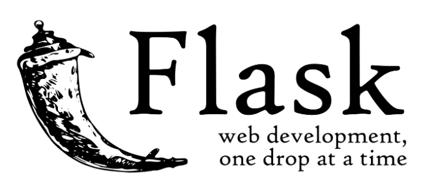

# Flask-MVC-Framework

Build a Flask CRUD Application with MVC Architecture  
How to implement a CRUD App with Flask Blueprint.

In order to build this application, we first need to understand the basic idea of CLIENT / SERVER. 
- The Client sends a request to the server. 
- The Server receives the client request, sends a request to the Database which sends back a response. 
- After manipulating the Database response, the Server then sends a response to the Client. 

In this approach, the Server response returns the entire page requested by the Client. For example, requesting the page /users returns all the HTML, CSS, and JS for that. A practical understanding of it is the render_template method from flask.

## Features

- MVC Structure
  - Site Configs
  - Controllers
  - Models
  - Views
    - Templating
- Built in Libraries
  - Database Handler
    - MongoDB
    - MySQL
  - Form Validator
  - JSON Response Builder
